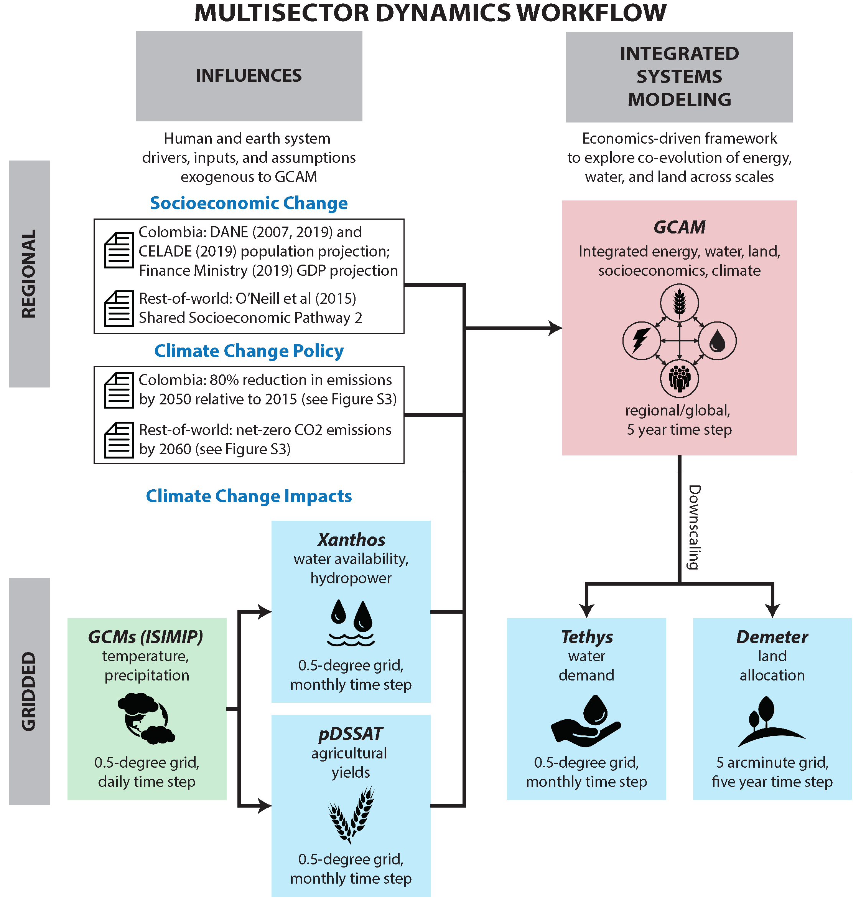

_your zenodo badge here_

# Wild-etal_2021_journal

**Informing Integrated Energy-Water-Land Planning in Colombia**

<!--
Thomas B. Wild<sup>1\*,2</sup>, Zarrar Khan<sup>2</sup>, Leon Clarke<sup>3</sup>, Mohamad Hejazi<sup>2</sup>, Brinda Yarlagadda<sup>3</sup>, German Romero<sup>4</sup>, Sioux Melo<sup>4</sup>, Ricardo Delgado<sup>5</sup>, Ricardo Arguello<sup>6</sup>, Andres Pinchao<sup>4,5</sup>, Silvia R. Santos Da Silva<sup>1</sup>, Mengqi Zhao<sup>1</sup>, Fernando Miralles-Wilhelm<sup>1</sup>, Raul Munoz-Castillo<sup>7</sup>, Chris Vernon<sup>2</sup>, Alison Delgado<sup>2</sup>, Jae Edmonds<sup>2</sup>, Abigail Birnbaum<sup>8</sup>, Jonathan Lamontagne<sup>8</sup>, Xin Zhao<sup>2</sup>
-->

<!--
<sup>1 </sup> Earth System Science Interdisciplinary Center (ESSIC), University of Maryland, College Park, MD 20740, USA <br/>
<sup>2 </sup> Joint Global Change Research institute, Pacific Northwest National Laboratory (PNNL), College Park, MD 20740, USA <br/>
<sup>3 </sup> School of Public Policy, University of Maryland, College Park, MD 20740, USA <br/>
<sup>4 </sup> National Planning Department (DNP) of Colombia, Bogota, Colombia <br/>
<sup>5 </sup> Universidad de los Andes, Bogota, Colombia <br/>
<sup>6 </sup> Universidad del Rosario, Bogota, Colombia <br/>
<sup>7 </sup> Inter-American Development Bank (IDB), Washington, DC, USA <br/>
<sup>8 </sup> Department of Civil and Environmental Engineering, Tufts University, Boston, MA, USA <br/>
-->

\* corresponding author:  twild@umd.edu


<!-------------------------->
<!-------------------------->
## Contents
<!-------------------------->
<!-------------------------->
- [Abstract](#abstract)
- [Plain Language Summary](#plain-language-summary)
- [Journal Reference](#journal-reference)
- [Code Reference](#code-reference)
- [Data Reference](#data-reference)
- [Contributing Modeling Software](#contributing-modeling-software)
- [Reproduce My Experiment](#reproduce-my-experiment)
- [Reproduce My Figures](#reproduce-my-figures)

<br />

<!-------------------------->
<!-------------------------->
## Abstract
<!-------------------------->
<!-------------------------->
Energy, water, and land (EWL) resource planning at regional (e.g., large river basin) and sub-regional (e.g., river sub-basin) scales has commonly been conducted in relative isolation by institutions focused on individual sectors, such as water supply or electricity. The effectiveness of this traditional approach is increasingly being strained by rapid integration among sectors; as well as by a range of regional and global forces, such as climate change, technological change, and socioeconomic change. In this stakeholder-driven study, Colombia serves as a testbed for exploring opportunities to enhance this traditional approach to EWL planning. We demonstrate the relative regional and sub-regional implications of socioeconomic change, climate change, and mid-century strategies to achieve substantial reductions in carbon emissions, for EWL supplies and demands in Colombia. To capture national, regional, and sub-regional EWL dynamics in a global context, the screening analytical framework we use couples a global integrated assessment model with a suite of globally consistent sectoral downscaling models to conditionally project the regional and sub-regional EWL implications of change. We find that socioeconomic change alone could double and triple water and electricity infrastructure investment needs respectively in Colombia by 2050. With respect to climate change impacts, while water exists in relative abundance in Colombia, climate change could potentially reduce runoff and associated hydropower production. This depletes cropland area for miscellaneous crops and potentially reduces hydroelectricity generation. Climate change impacts makes it more challenging to achieve low carbon development goals, and can add extra infrastructure investment cost by 2-3 billion USD annually.  Finally, we demonstrate that transformative changes in EWL systems will be required to substantially reduce carbon emissions by 2050, including increased cropland and water requirements, and shifts toward renewable power generation. We identify several regions and sectors in Colombia in which potential conflicts may emerge as a result of an additive confluence of socioeconomic, climatic, and policy drivers, including water scarcity in some regions that is fueled largely by agricultural water demands. However, the study also identifies nexus hotspots where opportunities for synergistic outcomes through integrated planning exist, such as the potential for joint management of hydropower and irrigation water in the Magdalena-Cauca River Basin. Ultimately, we find that integrated multi-sector planning in Colombia has the potential to guide future policy choices and investment decisions in a way that enhances societal benefit while limiting unintended consequences such as sectoral conflicts.

[Back to Contents](#contents)

<br />

<!-------------------------->
<!-------------------------->
## Plain Language Summary
<!-------------------------->
<!-------------------------->
<To Be Added>

[Back to Contents](#contents)

<br />

<!-------------------------->
<!-------------------------->
## Journal Reference
<!-------------------------->
<!-------------------------->
Edmonds, J., & Reilly, J. (1983). A long-term global energy-economic model of carbon dioxide release from fossil fuel use. Energy Economics, 5(2), 74-88. DOI: https://doi.org/10.1016/0140-9883(83)90014-2

[Back to Contents](#contents)

<br />

<!-------------------------->
<!-------------------------->
## Code Reference
<!-------------------------->
<!-------------------------->

[1] **Metis:** Khan, Z., Wild, T., Vernon, C., Miller, A., Hejazi, M., Clarke, L., Miralles-Wilhelm, F., Castillo, R.M., Moreda, F., Bereslawski, J.L., Suriano, M. and Casado, J., (2020). Metis v1.1.0. Github. [](https://github.com/JGCRI/metis/releases/tag/v1.0.0)

[2] **GCAM-LAC:** <To Be Added>

[3] **Xanthos:** <To Be Updated>

[4] **Demeter:** Vernon Chris, & Braun Caleb. (2020, December 30). demeter-v1.1.0 for Wild_et_al_2020_ArgentinaNexus (Version v1.1.0-wild2020-ArgentinaNexus). Zenodo. [](https://doi.org/10.5281/zenodo.4404738)

[5] **Tethys:** Vernon Chris, Link Robert, & Braun Caleb. (2020, December 31). tethys-v1.2.0 for Wild_et_al_2020_ArgentinaNexus (Version v1.2.0-wild2020-ArgentinaNexus). Zenodo. [](https://doi.org/10.5281/zenodo.4405008)

[6] **plutus:** Zhao, M., Binsted, M., Wild, T.B., Khan, Z., Yarlagadda, B., Iyer, G., Vernon, C., Patel, P., Santos da Silva, S.R., Calvin, K.V., (2021, May 18). JGCRI/plutus: plutus v1.0.0 (Version v1.0.0). Zenodo. [](https://doi.org/10.5281/zenodo.4771311)

[Back to Contents](#contents)

<br />

<!-------------------------->
<!-------------------------->
## Data Reference
<!-------------------------->
<!-------------------------->

<!-------------------------->
### Input Data
<!-------------------------->
[1] GCAM-LAC v5.3 input to be added.

[2] Demeter input to be added.


<!-------------------------->
### Output Data
<!-------------------------->

[1] Khan, Zarrar, Vernon, Chris, Wild, Thomas, and Zhao, Mengqi. (2020). **Xanthos** - Output Data (Version xanthos v2.3.1) [Data set]. Zenodo. http://doi.org/10.5281/zenodo.4422095

[2] Zhao, Mengqi, Wild, Thomas, Khan, Zarrar, and Yarlagadda, Brinda. (2022). **GCAM-LAC v5.3-stash** Output Data (GCAM-LAC v5.3-stash) [Data set]. Zenodo. https://doi.org/10.5281/zenodo.6226684

[3] Demeter output to be added.

[4] Tethys output to be added.

[Back to Contents](#contents)

<br />

<!-------------------------->
<!-------------------------->
## Contributing Modeling Software
<!-------------------------->
<!-------------------------->
| Model | Version | Repository Link | DOI |
|:-:|:-:|---|---|
| Xanthos | <v2.4.0> | <To Be Added> | <To Be Added> |
| GCAM-LAC | <v5.3> | <To Be Added> | <To Be Added> |
| Tethys | <v1.2.0> | <https://github.com/mengqi-z/tethys/tree/v1.2.0-wild2020-ArgentinaNexus> | <http://doi.org/10.5281/zenodo.4405008> |
| Demeter | <v1.1.0> | <https://github.com/mengqi-z/demeter/tree/v1.1.0-wild2020-ArgentinaNexus> | <https://doi.org/10.5281/zenodo.4404738> |

[Back to Contents](#contents)

<br />

<!-------------------------->
<!-------------------------->
## Reproduce My Experiment
<!-------------------------->
<!-------------------------->

We summarize 3 steps to reproduce the experiment conducted in this study:

**1. Run Preparation:** Download and install the software components and the supporting input data from [Input data](#input-data) required to conduct the experiement from [Contributing Modeling Software](#contributing-modeling-software)

**2. Model Integration:** Run the models and scripts in the `workflow` directory to re-create this experiment

<!--
| Script Name | Description | How to Run |
| --- | --- | --- |
| `step_one.py` | Script to run the first part of my experiment | `python3 step_one.py -f /path/to/inputdata/file_one.csv` |
| `step_two.py` | Script to run the last part of my experiment | `python3 step_two.py -o /path/to/my/outputdir` |
-->

**3. Validation:** Run the scripts in the `workflow` directory to compare my outputs to those from the publication

<!--
| Script Name | Description | How to Run |
| --- | --- | --- |
| `compare.py` | Script to compare my outputs to the original | `python3 compare.py --orig /path/to/original/data.csv --new /path/to/new/data.csv` |
-->
---

### [Step 1] Run Preparation

Download, clone, and install the software components and the supporting input data from [Input data](#input-data) required to conduct the experiement from [Contributing Modeling Software](#contributing-modeling-software).

<details>
<summary>1. Clone the Wild-etal_2021 repository (click to expand details)</summary>
<br />

* Clone ArgentinaNexus reproducible repository into your desired location.

```
git clone https://github.com/FeralFlows/wild-etal_2021_journal.git
```
---

</details>

<details>
<summary>2. Install R and GCAM related R packages (click to expand details)</summary>
<br />

There are several R packages providing functions to process and analyze model outputs, such as `metis`, `plutus` and `rgcam`. These packages are used frequently in the post-processing R scripts provided in the repository.

* Download and install R https://cran.r-project.org/ and R studio https://www.rstudio.com
* Install `metis`, `plutus`, and `rgcam`. Open R studio:

```
install.packages("devtools")
devtools::install_github("JGCRI/metis")
devtools::install_github("JGCRI/plutus")
devtools::install_github("JGCRI/rgcam")
```
---

</details>

<details>
<summary>3. GCAM-LAC v5.3 preparation (click to expand details)</summary>
<br />

***Pre-Requirements***
  
  * Download `GCAM-LAC v5.3` <DOI link to be provided>
  * Download `GCAM-LAC v5.3` input data 'input.zip' <DOI link to be provided>
  * Install Java 64 http://openjdk.java.net/
  * Install Windows XML Maker http://symbolclick.com/xmlmarker_1_1_setup.exe

---

</details>

<details>
<summary>4. pDSSAT preparation (click to expand details)</summary>
<br />

We provide codes to post-process `pDSSAT` outputs and create agriculture yield XML files for `GCAM` in this section. However, this step is OPTIONAL because we also provide XML files for agriculture yield in the downloadable GCAM input data in [Table 2](#table2). For information on `ISIMIP`/`pDSSAT` model, please refer to [Calvin et al., 2020](https://doi.org/10.1142/S2010007820500050); [Synder et al., 2020](https://doi.org/10.1371/journal.pone.0237918); and [Rosenzweig et al., 2016](https://doi.org/10.1073/pnas.1222463110).

  * Download `ISIMIP` (`pDSSAT` included) data and post-processing codes http://doi.org/10.5281/zenodo.4437737
  * Unzip downloaded isimip_yield_processing.zip and navigate to isimip_yield_processing/exe.
  * Run all the R scripts following the order from 'step1' to 'step4' labeled in the file name. Remember do not change the current working directory in R in between the steps.
  * You can find the created XML files in isimip_yield_processing/data/scenario_agprodchange_gcam512_uruguay/xml. The 20 files used in Argentina study are named in the format of 'ag_prodchange_[rcp]\_[gcm]\_pdssat.xml', where
    * [rcp] can be replaced by rcp2p6, rcp4p5, rcp6p0, or rcp8p5
    * [gcm] can be replaced by gfdl, hadgem2, ipsl, miroc, or noresm1
    * These XML files are the same with those under gcam-core_LAC_v02_5Nov2019/input/idb/impacts/Ag. If you want to use files reproduced by you, please change their names to the format of 'ag_prodchange_[gcm]_[rcp].xml', where
    * [gcm] can be replaced by GFDL-ESM2M, HadGEM2-ES, IPSL-CM5A-LR, MIROC-ESM-CHEM, or NorESM1-M
    * [rcp] can be replaced by rcp2p6, rcp4p5, rcp6p0, or rcp8p5

---

</details>

<details>
<summary>5. Xanthos, Demter, and Tethys preparation (click to expand details)</summary>
<br />

***Pre-requirements***

  * (Optional) Install PyCharm Professional version https://www.jetbrains.com/pycharm/download/#section=windows
  * Install Python 2.7 and Python 3.8 https://www.python.org/downloads/
  
  * Download `Xanthos v2.4.0` directly from http://doi.org/10.5281/zenodo.4728991, or clone `Xanthos v2.4.0`  to your desired location
  ```
  git clone https://github.com/JGCRI/xanthos.git --branch v2.4.0 Xanthos --single-branch
  ```
  Then, download `xanthos` example folder from **DOI to be added** to xanthos folder you just downloaded/cloned
  
  * Download `Demeter v1.1.0` directly from **DOI to be added**, or clone Demeter to your desired location and checkout the correct branch/tags 'v1.1.0-wild20201'
  ```
  git clone https://github.com/mengqi-z/demeter.git
  git checkout v1.1.0-wild2021-ColombiaEWL
  ```
  * Download Tethys directly from **DOI to be added**, or clone Tethys to your desired location and checkout the correct branch 'v1.2.0-wild2021' 
  ```
  git clone https://github.com/mengqi-z/tethys.git
  git checkout v1.2.0-wild2021-ColombiaEWL
  ```

  
**Note:* We will refer all the model folders to 'xanthos/', 'demeter/', and 'tethys/' in the following instructions. If you choose to download models directly from provided DOI links instead of cloning, please change each of the downloaded folder name to 'xanthos', 'demeter', and 'tethys'.

***Model Installation and Setup***\
The user is able to install each model as a Python package from terminal or command line. Navigate to each one of the downloaded model folders (xanthos/, demeter/, and tethys/) and run

```
python setup.py install
```


**Note:* More details of setting up Python using PyCharm for `Xanthos`, `Demeter`, and `Tethys` can be found in this [PyCharm setup tutorial](docs/Python_setup_for_xanthos_demeter_tethys.md). You can also go to Github page for each model listed in [Contributing Modeling Software](#contributing-modeling-software) for more information.

***File Replacement***\
For downloaded models from DOI links provided in [Contributing Modeling Software](#contributing-modeling-software) section, most of the input dataset in terms of a single GCM/RCP scenario (i.e., GFDL-ESM2M forced by RCP 2.6) selected in the Argentina study is included, except for Xanthos due to large size of the dataset. Follow the steps below to add data into the downloaded xanthos folder.

  * Unzip historical climate data xanthos/example/input/climate/watch+wfdei.zip
  * Download projected climate data for 5 GCMs in [temporary Google Drive link](https://drive.google.com/drive/folders/1gLK1uAHsGRGolKg1Y0896QZzB9AD8OiE?usp=sharing). Move 5 downloaded data folders under the directory xanthos/example/input/climate/. **This is a temporary link from google drive and only people with permission will be able to download. We will replace the temporary link with DataHub DOI once it is created.*

***File Modification***\
Check each file listed in [Table 5](#table5) and modify every directory within those files to the directory that holds your data. For example, in configuration file 'pm_abcd_mrtm_future_impacts.ini' for xanthos model, change the directory of 'RootDir' to 'your-xanthos-location\example'.

<a name="table5"></a>
**Table 5:** Files to be modified for each model.

| Model | Programming Language | Files to be Modified |
|---|:-:|---|
| Xanthos | Python 3.3+ | under xanthos/example: <br /> (1) pm_abcd_mrtm_future_impacts.ini <br /> (2) future_sim_IDBFinalRuns.py <br /> (3) watch_impacts.ini <br /> (4) watch_wfdei_sim.py |
| Demeter | Python 2.7 | under demeter/example: <br /> (1) config_LAC.ini <br /> (2) example_LAC.py |
| Tethys | Python 3+ | under tethys/example: <br /> (1) config.ini |


---

</details>

<br />

### [Step 2] Model Integration

[Figure 1](#figure1) details the workflow for reproducing all model outputs once [Step 1](#step-1-run-preparation) is completed.
  * First, we run `pDSSAT` and `Xanthos` to calculate crop yield, runoff, and hydropower under climate change scenarios. These runoff and hydropower outputs need to be bias corrected. Outputs from both `pDSSAT` and `Xanthos` need to be converted to XML format in order to feed into `GCAM-LAC v5.3`.
  * Second, we use `GCAM-LAC v5.3` to simulate integrated energy, water, land, socioeconomic, and climate interactions at regional/global scale.
  * Third, downscale land allocation and water demand from regional scale to subregional scale to inform policy making:
    * Use `Demeter` to downscale global land allocation to subregional land allocation (e.g., 0.5-degree grid resolution).The output of `GCAM-LAC v5.3` will be post-processed to certain format to be able to feed into `Demeter`.
    * Use `Tethys` to downscale global water withdrawal from `GCAM-LAC v5.3` to subregional water withdrawal (e.g., 0.5-degree grid resolution). The model can directly use `GCAM-LAC v5.3` output without post-processing.

<a name="figure1"></a>

<p align="center"> </p>

**Figure 1.** The multi-model, multi-scale, multi-sector analysis framework.
<br />

**In the following tutorial, We use terminal as an example to run python based models. If you prefer running from an IDE (e.g., PyCharm), check [PyCharm setup tutorial](docs/Python_setup_for_xanthos_demeter_tethys.md) for more details.**

<details>
<summary>1. Xanthos (click to expand details)</summary>
<br />
To run Xanthos:

  * In the terminal, run Xanthos with historical climate data by navigating to xanthos/example, and run
  ```
  python watch_wfdei_sim.py
  ```
  * Run Xanthos with projected climate data by navigating to xanthos/example, and run
  ```
  python future_sim_IDBFinalRuns.py
  ```

To process Xanthos outputs for GCAM:
  * Change all the directories appeared in 'basin_runoff_analysis_plotting.R', 'hydro_analysis_plotting.R', and 'xanthos_postprocessing_fns.R' to paths that holds you data (file locations listed in [Table 6](#table6)).
  * Post-process Xanthos runoff output by running R script 'basin_runoff_analysis_plotting.R' listed in [Table 6](#table6). This will create same XML files within the downloaded GCAM input data folder: input/idb/impacts/Water. You may replace corresponding XML files in gcam-LAC_5p3/input/idb/impacts/Water with the ones you reproduced.
  * Post-process Xanthos hydropower output by running R script 'hydro_analysis_plotting.R' listed in [Table 6](#table6). This will create same XML files within the downloaded GCAM input data folder: input/idb/impacts/Hydro. You may replace corresponding XML files in gcam-LAC_5p3/input/idb/impacts/Hydro with the ones you reproduced.

**Note:* The post-process step is optional because all reproduced XML files are already included in the downloaded GCAM input data folder.

---

</details>

<details>
<summary>2. GCAM-LAC v5.3 (click to expand details)</summary>
<br />

* Go to gcam-LAC_5p3/exe and open 'run-gcam.bat' in a text editor. Change the Run GCAM line to point to configuration_LAC.xml: ```Objects-Main.exe -C configuration_LAC.xml```.
* Run GCAM by double clicking 'run-gcam.bat' to run the model.
* Check GCAM output database located in gcam-LAC_5p3/output/FinalRuns/IDBNexus.
* One quick way to check GCAM output database is to use GCAM ModelInterface. Go to gcam-LAC_5p3/ModelInterface, double click 'run-model-interface.bat'. For more instruction on using ModelInterface, please refer to [GCAM Documentation](https://github.com/JGCRI/gcam-core).

---
</details>

<details>
<summary>3. Tethys (click to expand details)</summary>
<br />

* GCAM output database is the input data for Tethys. Copy and paste 'IDBNexus' folder under gcam-LAC_5p3/output/FinalRuns to tethys/example/Input/GCAM.
* Change the name for parameter 'GCAM-DBfile' in the configuration file (tethys/example/config.ini) to your pasted folder name 'IDBNexus'.
* Change the name for parameter 'ProjectName' in config.ini to the name you prefer for the folder holding the outputs. For example, 'gcam-LAC_5p3_IDBNexus'.
* In the terminal, run Tethys by navigating to tethys/example, and run
```
python example.py
```

**Note:* You may notice that there are three GCAM database folders already existing under tethys/example/Input/GCAM (e.g., IDBNexus_MIROC-ESM-CHEM_rcp6p0_Reference). This is because the GCAM output database from YOUR GCAM run will integrate all three scenarios together including Reference, Impacts, and Policy scenario. However, Tethys will only recognize the very first scenario (i.e., Reference scenario), while ignoring the other two scenarios. By separating three scenarios into three different GCAM databases, you will be able to run tethys with each database of a single scenario and get the water withdrawal output for each scenario. To do that, open config.ini, change the name for parameter 'GCAM-DBfile' to the database folder name you would like to use (e.g., IDBNexus_MIROC-ESM-CHEM_rcp6p0_Reference), and change the name for parameter 'ProjectName' to the name you prefer for the output folder (e.g., gcam_5p1_MIROC-ESM-CHEM_rcp6p0_Reference).

---
</details>

<details>
<summary>4. Demeter (click to expand details)</summary>
<br />

* (Optional) Process GCAM output to Demeter required format by running 'gcam_to_demeter_land_allocation_rgcam.R' (see [Table 6](#table6)). Remember to change all the paths in the R script based on your data location. This R script creates the projected land class allocation files under Reference, Impacts, and Policy scenarios that are already existed in demeter/example/inputs/projected.
* In the terminal, run Demeter by navigating to demeter/example, and run
```
python example_LAC.py
```
* The cell resolution for Demeter output is 5 arcmin (0.0833 degree). Aggregate output from 5 arcmin to 0.5 degree by running R script 'aggregate_5arcmin_to_0p5degree.py' (see [Table 6](#table6)). Remember to change all the directories in this python file according to your data location and the 'run' names associated with your demeter output folder names. Then, run the python script in the terminal by navigating to ArgentinaNexus/Figures/DemeterProcessing and run
```
python aggregate_5arcmin_to_0p5degree.py
```
---
</details>


<br />

### [Step 3] Validation


[Back to Contents](#contents)

<br />

<!-------------------------->
<!-------------------------->
## Reproduce My Figures
<!-------------------------->
<!-------------------------->
Use the scripts found in the `figures` directory to reproduce the figures used in this publication.

| Script Name | Description | How to Run |
| --- | --- | --- |
| `generate_figures.py` | Script to generate my figures | `python3 generate_figures.py -i /path/to/inputs -o /path/to/outuptdir` |

[Back to Contents](#contents)

<br />